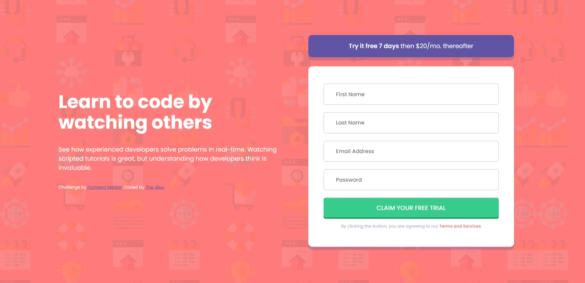
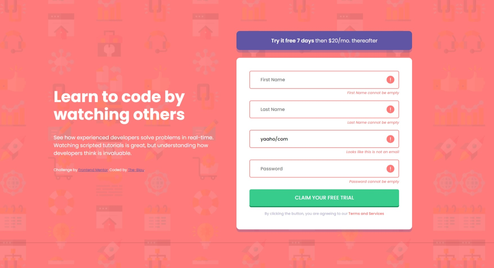

# Frontend Mentor - Intro component with sign up form


# Frontend Mentor - Intro component with sign up form solution

This is a solution to the [Intro component with sign up form challenge on Frontend Mentor](https://www.frontendmentor.io/challenges/intro-component-with-signup-form-5cf91bd49edda32581d28fd1). Frontend Mentor challenges help you improve your coding skills by building realistic projects. 

## Table of contents

- [Overview](#overview)
  - [The challenge](#the-challenge)
  - [Screenshot](#screenshot)
  - [Links](#links)
- [My process](#my-process)
  - [Built with](#built-with)
  - [What I learned](#what-i-learned)
  - [Continued development](#continued-development)
  - [Useful Resources](#useful-resources)
- [Author](#author)

## Overview

### The challenge

Users should be able to:

- View the optimal layout for the site depending on their device's screen size
- See hover states for all interactive elements on the page
- Receive an error message when the `form` is submitted if:
  - Any `input` field is empty. The message for this error should say *"[Field Name] cannot be empty"*
  - The email address is not formatted correctly (i.e. a correct email address should have this structure: `name@host.tld`). The message for this error should say *"Looks like this is not an email"*

### Screenshot

- Without Warning



- With Warning



### Links

- Solution URL: [https://github.com/the-bipu/Sign-Up-Form-Component]
- Live Site URL: [https://sign-up-form-intro-component.netlify.app/]

## My process

### Built with

- Semantic HTML5 markup
- CSS custom properties
- Flexbox
- CSS Grid
- Mobile-first workflow
- [React](https://reactjs.org/) - JS library

### What I learned

- This code is just live-saver and i'm telling it because at first i have written the code for these funtionality and that was so repetitive. Now i can set validation on many fields possible by just adding one or two lines of code.

```
function useFormInput(initialValue, validationFn) {
    const [value, setValue] = React.useState(initialValue);
    const [isValid, setIsValid] = React.useState(true);

    const handleChange = (event) => {
        const newValue = event.target.value;
        setValue(newValue);
        setIsValid(validationFn(newValue));
    };

    return {
            value,
            isValid,
            onChange: handleChange,
        };
    }

    const mailRegex = /^[a-zA-Z][a-zA-Z0-9\-\_\.]+@[a-zA-Z0-9]{2,}\.[a-zA-Z0-9]{2,}$/;

    const fnameInput = useFormInput("", (value) => value.trim() !== "");
    const lnameInput = useFormInput("", (value) => value.trim() !== "");
    const emailInput = useFormInput("", (value) => value.match(mailRegex));
    const passwordInput = useFormInput("", (value) => value.trim() !== "");
```

### Continued development

- This project is complete as per the given requirements and now i would like to make the react code as neat and clean as possible, cause till now it's so repetitive and that's not our way to code.

### Useful resources

- [Uncaught Error](https://stackoverflow.com/questions/62736390/error-message-create-react-app-index-pack-js1-uncaught-syntaxerror-unexpect) - This helped me for getting out of the Uncaught error.
- [className on class](https://bobbyhadz.com/blog/react-invalid-dom-property-class#invalid-dom-property-class-warning-in-react) - This is an amazing article which helped me in getting out of the syntax error(use className on the place of class). I'd recommend it to anyone still learning this concept.

## Author

- Github - [The-Bipu](https://github.com/the-bipu)
- Frontend Mentor - [@the-bipu](https://www.frontendmentor.io/profile/the-bipu)
